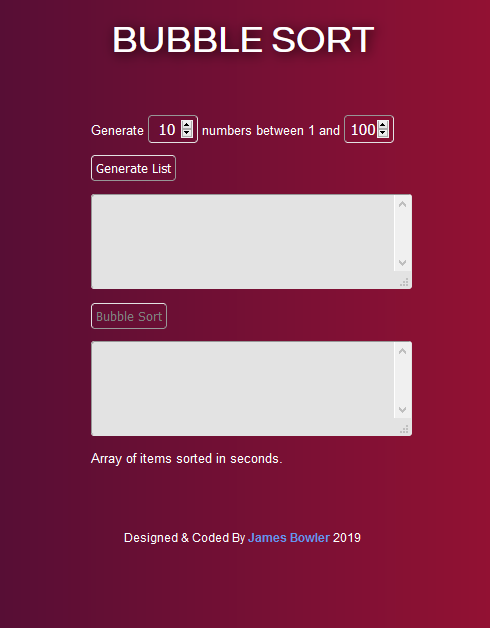

# Bubble Sort Project

A little project made while learning about sorting algorithms while studying with the Open University.
The project allows you to generate a list of random numbers and sort them using bubble sort. For the result it shows you the time it took so you can compare it to more efficient algorithms.

Coded with HTML5 CSS3 & JavaScript

##### To Start:

1. View live [here](https://bubblesort-jb.netlify.app/)
2. Run on live server in VsCode

##### Screenshot

